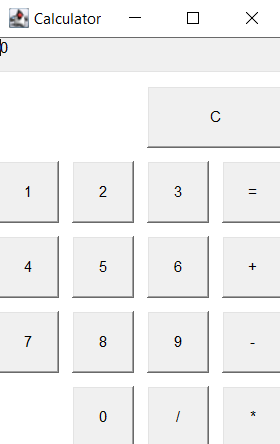

# Calculator

**This is a simple calculator application implemented in Java using the Abstract Window Toolkit (AWT) for the user interface. The calculator provides basic arithmetic operations such as addition, subtraction, multiplication, and division.**

## Features
* Addition: Perform addition of two numbers.
* Subtraction: Perform subtraction of two numbers.
* Multiplication: Perform multiplication of two numbers.
* Division: Perform integer division of two numbers.
* Clear: Clear the input fields and result.

## Prerequisites

## Getting Started
1. Install Java Development Kit (JDK).
1. Download the repository to your local machine or clone it by `git clone https://github.com/denomelchenko/Calculator.git`
1. Navigate to the project directory by `cd calculator`
1. Compile the Java source files `javac Calculator.java`
1. Run compiled application `java Calculator`

## Usage
1. The calculator window will appear on the screen.
2. Enter numbers using the number buttons (0-9) or the numeric keypad.
3. Perform arithmetic operations by clicking on the corresponding buttons (`+`, `-`, `*`, `/`)
4. To clear the current input, click the "C" button.
5. To calculate the result, click the `=` button.
6. The result will be displayed in the calculator's text field.

## Screenshots

## License
This project is licensed under the MIT License - see the [LICENSE](LICENSE) file for details.
